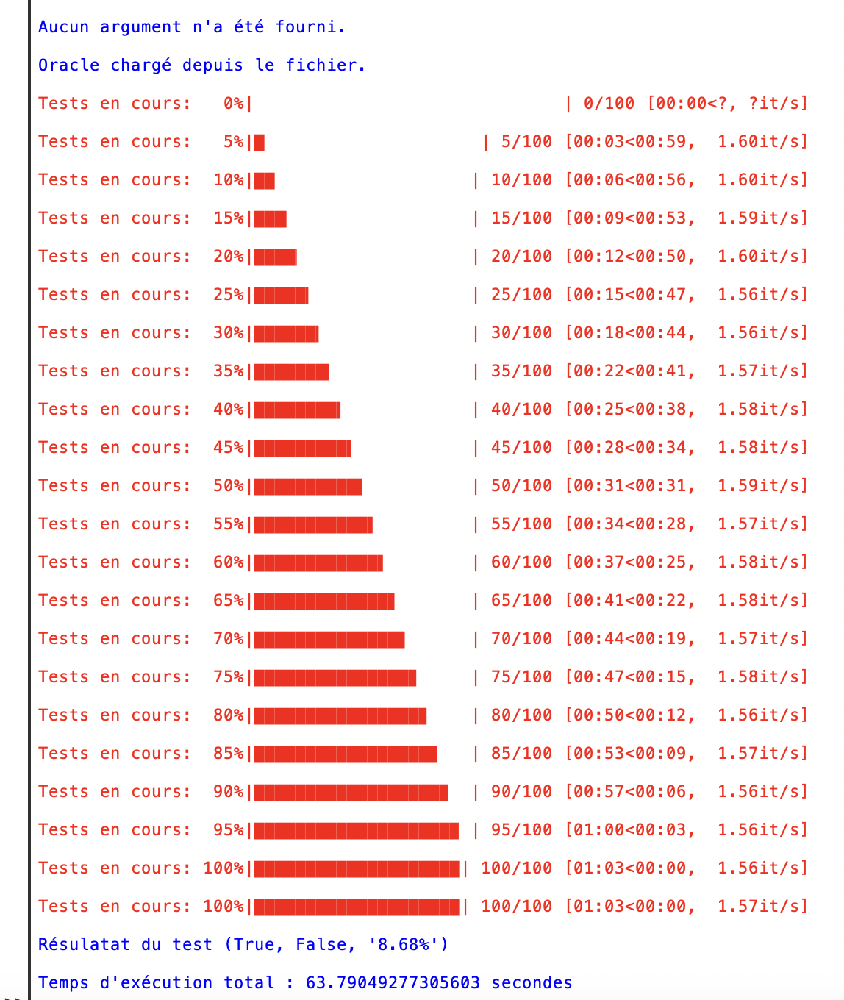

# Computer-generated-harmonic-sequence-rule-extractor

# Frensh version [FR]
_English version below the French version_

###  Description
Le projet "Computer-generated-harmonic-sequence-rule-extractor" est un outil conçu pour créer un oracle destiné à vérifier la validité d'une séquence harmonique générée par ordinateur. L'oracle peut être utilisé pour valider si une séquence donnée suit les règles d'une séquence harmonique.

### Fonctionnalités principales :
* Création d'un oracle à partir d'une liste de séquences harmoniques.
* Validation d'une séquence donnée en utilisant l'oracle.
* Calcul des pourcentages d'échecs lors de la validation de l'oracle.

### Installation
1. Cloner ce dépôt sur votre machine locale.
2. Assurez-vous d'avoir Python installé sur votre système.
3. Installez les dépendances en exécutant la commande suivante : ``pip install tqdm``
4. Exécutez le fichier main.py pour lancer l'application : ``python main.py``

### Dépendances 
* sys
* time
* tqdm
* pickle
* random
* csv

### Exemples d'utilisation
#### Exemple 1 : Validation d'une séquence
Pour valider une séquence, exécutez le fichier main.py sans fournir d'argument :
``python main.py``

#### Exemple 2 : Vérification d'une séquence spécifique
Pour vérifier une séquence spécifique, exécutez le fichier main.py en lui passant la séquence en argument :
``python main.py [séquence]``

#### **Captures d'écran**

*Exemple d'exécution pour 10 itérations :*

*Exemple d'exécution pour 100 itérations :*

## English version [EN]

### Description

The "Computer-generated-harmonic-sequence-rule-extractor" project is a tool designed to create an oracle to verify the validity of a computer-generated harmonic sequence. The oracle can be used to validate whether a given sequence follows the rules of a harmonic sequence.

### Key Features

* Creation of an oracle from a list of harmonic sequences.
* Validation of a given sequence using the oracle.
* Calculation of failure percentages when validating the oracle.

### Installation

1. Clone this repository to your local machine.
2. Ensure you have Python installed on your system.
3. Install dependencies by running the following command: ``pip install tqdm``
4. Run the main.py file to launch the application: ``python main.py``

### Dependencies

* sys
* time
* tqdm
* pickle
* random
* csv

### Usage Examples
#### Example 1: Validating a Sequence

To validate a sequence, run the main.py file without providing any argument: ``python main.py``

#### Example 2: Checking a Specific Sequence

To check a specific sequence, run the main.py file with the sequence as an argument: ``python main.py [sequence]``

#### Screenshots

_Example execution for 10 iterations_

_Example execution for 100 iterations_

## Licence
Ce projet est sous licence [MIT](LICENSE).
